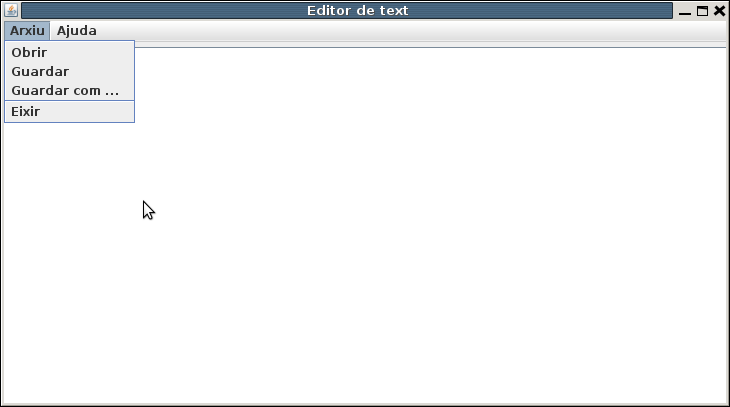

# **Exercicis**
## <span style="color: blue;"> Exercici 2_1 </span> 

Aquest primer exercicis és per a tractament de bytes, ja que es tractarà de modificar una imatge. Per a poder provar-lo podeu utilitzar la imatge **Penyagolosa.bmp** que se us proporciona en l'aula virtual i l'heu de copiar al directori arrel del projecte **Tema2** per a un funcionament més còmode.

**No es pretén construir un editor d'imatges. Tan sols pretenem agafar la informació del fitxer byte a byte, realitzar alguna transformació en els bytes i guardar-la en un altre fitxer.**

El format d'un fitxer **bmp**, aproximadament és el següent:

- En els 54 primers bytes es guarda informació diversa, com la grandària de la imatge, paleta de colors, ...
- A partir d'ahí es guarda **cada punt** de la imatge com **3 bytes**, un per al roig (R), un per al verd (G) i i un per al blau (B), anant d'esquerra a dreta i de dalt a baix.

Copia't i modifica la classe **FitxerImatge** en el paquet **exercicis**, creant els mètodes oportuns seguint aquestes pautes:

- El constructor **FitxerImatge(File fEnt)** ha d'inicialitzar la propietat **f** (**File**) **si i només si** existeix el fitxer i l'extensió del fitxer és **.bmp** (ho controlarem senzillament perquè el nom del fitxer acaba així). En cas contrari, traure els missatges d'error oportuns per l'eixida estàndar.
- Els mètodes de transformació (**transformaNegatiu**, **transformaObscur** i el voluntari **transformaBlancNegre**) han de crear un nou fitxer que contindrà la imatge transformada com veurem més avant. El nom del nou fitxer s'ha de formar a partir del nom del fitxer d'entrada, el que hem guardat en el constructor. Serà sempre posant abans del .bmp un guió baix i un identificatiu de la transformació realitzada: **_n** per al negatiu, **_o** per a l'obscur i **_bn** per al blanc i negre (part voluntària). És a dir, si el fitxer d'entrada fóra **imatge1.bmp**, el d'eixida haurà de ser: 
  - **imatge1_n.bmp** per al mètode **transformaNegatiu**
  - **imatge1_o.bmp** per al mètode **transformaObscur**
  - **imatge1_bn.bmp** per al mètode voluntari **transformaBlancNegre**
- En cada transformació, els primers 54 bytes s'han de copiar sense modificar: s'han d'escriure en el fitxer de destí  tal i com s'han llegit del fitxer d'entrada
- A partir del 54, cada vegada que es llegirà un byte, s'haurà de transformar abans d'escriure'l en el destí. La transformació és d'aquesta manera: 
  - Per al **negatiu** (**transformaNegatiu**), cada byte de color (RGB) de cada punt, s'ha de transformar en el complementari. Com estem parlant de bytes però que en llegir els guardem en enters, senzillament serà calcular **255 - b** (si b és el byte llegit).
  - Per a l'**obscur** (**transformaObscur**), cada byte de color (RGB) de cada punt, s'ha de baixar d'intensitat a la meitat. Senzillament serà calcular **b / 2** (si b és el byte llegit).
  - Per al **blanc i negre** (**transformaBlancNegre**), que és el voluntari, hem de donar el mateix valor per al roig, el blau i el verd (RGB) de cada punt, i així aconseguirem un gris d'intensitat adequada. Una bona manera serà **llegir els tres bytes** de cada punt (**no s'aconsella utilitzar una lectura amb un array de 3 posicions**; millor fer tres lectures guardades en tres variables diferents), **calcular la mitjana** d'aquestos 3 valors, i **escriure el resultat 3 vegades** en el fitxer de destí.
  - En cap dels casos anteriors es recomana la lectura dels bytes en un ByteArray, perquè podeu tenir resultats imprevisibles a causa de la interpretació numèrica (i per tant amb signe, cosa que en aquest cas no té sentit, ja que han són números del 0 al 255). **Es recomana vivament llegir byte a byte**.

A mode orientatiu del que es vol fer, us adjunte la classe **FitxerImatge** a la qual heu de modificar el constructor i els tres mètodes de transformació (l'últim és voluntari). Recordeu que ha d'anar al paquet **exercicis**.
```java
package exercicis

import java.io.File

class FitxerImatge(fEnt: File) {
  var f: File = File("")   // No modifiqueu aquesta línia. El seu valor s'ha de modificar en el constructor
  init {
    // Constructor
    // Control d'existència del fitxer i control de l'extensió .bmp (traure missatges d'error)
    // En cas que tot siga correcte, inicialitzar f amb fEnt
  }

  fun transformaNegatiu() {
    // Transformar a negatiiu i guardar en _n.bmp
  }

  fun transformaObscur() {
    // Transformar a una imatge més fosca i guardar en _o.bmp
  }

  \* Partvoluntària
  fun transformaBlancNegre() {
    // Transformar a una imatge en blanc i negre i guardar en _bn.bmp
  }
*/
}
```
Aquest seria un exemple de programa principal, que podeu utilitzar si voleu. Recordeu que ha d'anar al paquet **exercicis** i li podeu donar el nom **Exercici_2_1.kt.**
```java
package exercicis

import java.io.File

fun main(args: Array<String>){
  val f = File("Penyagolosa.bmp")

  val fi = FitxerImatge(f)
  fi.transformaNegatiu()
  fi.transformaObscur()
  //voluntari
  //fi.transformaBlancNegre()
}
```


Per a la imatge que se us proporciona (i que està en la construcció del File del programa principal), que és la de l'esquerra, haurien d'eixir les de la dreta:

|**Imatge inicial**|**negatiu**|**obscur**|**blanc i negre (voluntari)**|
| :-: | :-: | :-: | :-: |
|||||
|**Penyagolosa.bmp**|**Penyagolosa_n.bmp**|**Penyagolosa_o.bmp**|**Penyagolosa_bn.bmp**|

## <span style="color: blue;"> Exercici 2_2 </span>

Aquest programa serà el primer que utilitzarà components gràfics.

Per a entendre els components gràfics de la llibreria **Swing** i els contenidors de la llibreria **Awt**, que són els que utilitzarem, us aconselle que us mireu l'annex **Gràfics en Java: llibreries** **AWT i SWING** que teniu en la secció d'annexos, al final del curs de Moodle. De tota manera, us proporcione "l'esquelet" del programa, i només us demane que feu les sentències de quan s'apreten els botons d'obrir i de guardar.

Anem a fer un senzill editor de text amb el següent aspecte:


En el JTextField de dalt posarem el nom (i ruta) del fitxer.

- Quan apretem al botó **Obrir** ha de bolcar el contingut del fitxer al **JTextArea** (controlant prèviament que existeix el fitxer).
- Quan apretem a **Guardar**, ha de bolcar el contingut del **JTextArea** en el fitxer (el nom del qual tenim en el **JTextField**).

L'esquelet del programa és el que trobareu a continuació. He utilitzat la filosofia de l'annex, que consisteix a tenir al final de tot el programa principal (el main) que invoca amb posterioritat (**invokeLater**) una funció que crea l'objecte de la classe que hereta de **JFrame**, que és realment la finestra, i la fa visible.

Una vegada copiat en el paquet **exercicis** del projecte **Tema2** per exemple amb el nom **Exercici_2_2.kt**, només heu de completar el que teniu al final de tot d'aquesta classe on estan els comentaris, és a dir els mètodes **addActionListener** dels botons **obrir** i **guardar**
```java
package exercicis

import javax.swing.\*
import java.awt.\*

class Exercici_2_2_Pantalla : JFrame() {
  val et_f = JLabel("Fitxer:")
  val fitxer = JTextField(25)
  val obrir = JButton("Obrir")
  val guardar = JButton("Guardar")
  val et_a = JLabel("Contingut:")
  val area = JTextArea(10, 50)
  val scrollPane = JScrollPane(area)

  // en iniciar posem un contenidor per als elements anteriors
  init {
    defaultCloseOperation = JFrame.EXIT_ON_CLOSE
    setLayout(GridLayout(2, 1))
    setTitle("Editor de text")
    val panell1 = JPanel(GridLayout(0, 1))
    val panell1_1 = JPanel(FlowLayout())
    panell1.add(panell1_1)
    panell1_1.add(et_f)
    panell1_1.add(fitxer)

    val panell1_2 = JPanel(FlowLayout())
    panell1.add(panell1_2)
    panell1_2.add(obrir)
    panell1_2.add(guardar)
    val panell2 = JPanel(GridLayout(0, 1))
    panell2.add(scrollPane)
    area.setEditable(true)

    add(panell1)
    add(panell2)
    pack()

    obrir.addActionListener {
    // Instruccions per a bolcar el contingut del fitxer en el JTextArea
    
    }

    guardar.addActionListener {
    // Instruccions per a guardar el contingut del JTextArea al fitxer.

    }
  }
}

private fun crearMostrarFinestra() {

  val frame = Exercici_2_2_Pantalla()
  frame.isVisible = true
}

fun main(args: Array<String>) {
  EventQueue.invokeLater(::crearMostrarFinestra)
}
```
## <span style="color: blue;"> Exercici 2_3 Voluntari </span>

Com a exercici voluntari us propose una altra versió del Editor de Text de l'anterior exercici.

Ara serà únicament un JTextArea, i les opcions les tindrem en menú. Utilitzeu el component **JFileChooser**  per a buscar fitxers i per a guardar-los que ens proporciona **Swing**. Ja teniu implementada l'opció d'eixir.



Si teniu temps i ganes, afegiu un component baix de tot per a triar la codificació entre **UTF-8** i **ISO-8859-15**

Aquest seria l'esquelet del programa principal i la classe que implementa JFrame. El podeu guardar per exemple en **Exercici_2_3.kt**:

```java
package exercicis

import javax.swing.\*
import java.awt.\*
import java.io.File

class Exercici_2_3 : JFrame() {
  val area = JTextArea()
  val scrollPane = JScrollPane(area)

  val menu_p = JMenuBar()

  val menu_arxiu = JMenu("Arxiu")
  val menu_ajuda = JMenu("Ajuda")

  val obrir = JMenuItem("Obrir")
  val guardar = JMenuItem("Guardar")
  val guardarCom = JMenuItem("Guardar com ...")
  val eixir = JMenuItem("Eixir")

  val quantA = JMenuItem("Quant a Editor")
  
  val fCh = JFileChooser()

  // en iniciar posem un contenidor per als elements anteriors
	init {
		defaultCloseOperation = JFrame.EXIT_ON_CLOSE

		setLayout(BorderLayout())
		setTitle("Editor de text més avançat")
		add(scrollPane)
		area.setEditable(true)

		setSize(750, 400)
        setJMenuBar(menu_p)

        menu_p.add(menu_arxiu)
        menu_p.add(menu_ajuda)
        
        menu_arxiu.add(obrir)
        menu_arxiu.add(guardar)
        menu_arxiu.add(guardarCom)
        menu_arxiu.add(JSeparator())
        menu_arxiu.add(eixir)
        
        menu_ajuda.add(quantA);

		    obrir.addActionListener { obrir() }

		    guardar.addActionListener { guardar() }

		    guardarCom.addActionListener { guardarCom() }

		    eixir.addActionListener { eixir() }

		    quantA.addActionListener { quantA() }
	}

	fun obrir() {
		// Instruccions per a obrir un fitxer i posar el contingut en el JTextArea

	}

	fun guardar() {
		// Instruccions per a guardar el contingut del JTextArea al fitxer.

	}

	fun guardarCom() {
		// Instruccions per a guardar el contingut del JTextArea al fitxer, amb la possibilitat de canviar el nom

	}

	fun eixir() {
		// Instruccions per a eixir
		System.exit(0)
	}

	fun quantA() {
		// Instruccions per a mostrar un diàleg amb la versió (Acerca de...)

	}
}


fun main(args: Array&lt;String&gt;) {
	EventQueue.invokeLater( { Exercici_2_3().isVisible = true })
}
```